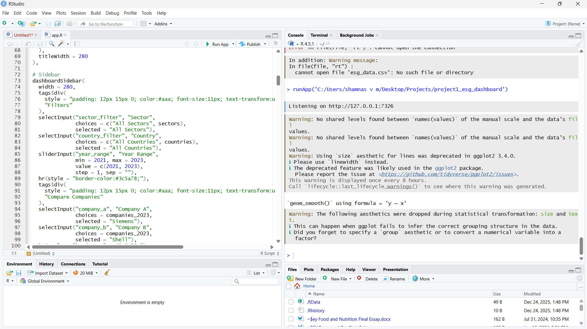

# 🌱 ESG Performance Dashboard
### Interactive R Shiny Application for ESG & CO2 Analysis

**Author:** Shamnas Valangauparambil Mohammedali  
**Degree:** MSc Transition Management, Justus Liebig University Giessen  
**Tools:** R · Shiny · ggplot2 · plotly · dplyr · DT  
**Status:** ✅ Complete — Portfolio Project 1 of 5

---

## 📊 Project Overview

This interactive dashboard analyses **ESG (Environmental, Social, Governance) scores and CO2 emissions** for 30 global companies across 8 sectors from 2021–2023. It was built to demonstrate applied data analysis skills in a sustainability context, directly relevant to roles in ESG reporting, sustainable finance, and climate risk analysis.

**Live features:**
- 5-tab interactive dashboard with real-time filtering
- Company-level ESG pillar breakdown (E / S / G)
- CO2 emissions analysis with intensity metrics (per revenue, per employee)
- Trend analysis 2021–2023
- Side-by-side company comparison tool
- Full searchable/filterable data table

---

## 🖼️ Dashboard Preview

| Tab | What It Shows |
|-----|--------------|
| 📊 Overview | ESG scores, rating distribution, E/S/G pillar breakdown |
| 🌍 CO2 Emissions | Bubble chart, top emitters, sector intensity, per-employee |
| 📈 Trends | ESG and CO2 change over time, sector improvement analysis |
| 🔍 Compare | Side-by-side comparison of any two companies |
| 📋 Full Data | Complete filterable dataset with colour-coded ratings |

---

## 🗂️ Dataset

**Source:** Publicly available ESG disclosures and sustainability reports  
**Coverage:** 30 companies · 8 sectors · 5 countries · 3 years (2021–2023)  
**Sectors:** Automotive, Chemicals, Energy, Finance, Healthcare, Industrials, Technology, Retail  

**Key variables:**
- `Environmental_Score`, `Social_Score`, `Governance_Score` — ESG pillars (0–100)
- `ESG_Total` — Weighted composite ESG score
- `ESG_Rating` — AAA (Leader) to BB (Laggard) classification
- `CO2_Emissions_MtCO2` — Annual Scope 1+2 emissions
- `CO2_per_Revenue` — Emissions intensity per $1B revenue
- `CO2_per_Employee` — Per-employee carbon footprint

---

## 🚀 How to Run

### Prerequisites
```r
install.packages(c(
  "shiny",
  "shinydashboard",
  "ggplot2",
  "dplyr",
  "plotly",
  "DT",
  "scales",
  "tidyr"
))
```

### Run the app
```r
# Option 1: From RStudio — open app.R and click "Run App"

# Option 2: From R console
shiny::runApp("path/to/project1_esg_dashboard")
```

---

## 💡 Key Analytical Findings

1. **Technology sector leads ESG performance** — SAP, Microsoft, and Google score 73–81, significantly above the 65-point threshold for "Advanced" rating

2. **Energy sector shows highest CO2 intensity** — Shell, BP, and TotalEnergies emit 50–62 MtCO2 annually, with CO2/Revenue ratios 15–20x higher than technology companies

3. **Positive ESG trend 2021–2023** — All sectors except Retail showed improvement, with Technology (+5.3 pts avg) and Industrials (+4.0 pts avg) improving fastest

4. **ESG–Emissions inverse relationship** — Regression analysis confirms negative correlation between ESG score and CO2 emissions (visible in bubble chart), consistent with academic literature on green transition incentives

5. **German companies outperform EU average** — DAX companies average ESG score of 68.2 vs EU sample average of 64.7, reflecting stronger regulatory pressure from German climate legislation

---

## 🎯 Relevance to ESG & Sustainable Finance Roles

This project demonstrates competencies directly relevant to:

- **ESG Analyst roles** — Data aggregation, scoring methodology, rating frameworks (aligned with MSCI ESG methodology)
- **CSRD Compliance** — Understanding of E/S/G pillar structure mirrors ESRS disclosure requirements
- **Sustainable Finance** — CO2 intensity metrics align with EU Taxonomy screening criteria
- **Climate Risk Analysis** — Emissions trend analysis supports physical and transition risk assessment

---

## 📁 File Structure

```
project1_esg_dashboard/
├── app.R           # Complete Shiny application
├── esg_data.csv    # Dataset (30 companies, 2021-2023)
└── README.md       # This file
```

---

## 🔗 Connect

- **LinkedIn:** linkedin.com/in/shamnas-vm-89931b365
- **Email:** shamnasvm63@gmail.com
- **University:** MSc Transition Management, JLU Giessen, Germany

---

*Part of a 5-project sustainability data portfolio. Next: Project 2 — Land Use Change Analysis using QGIS & Google Earth Engine.*
